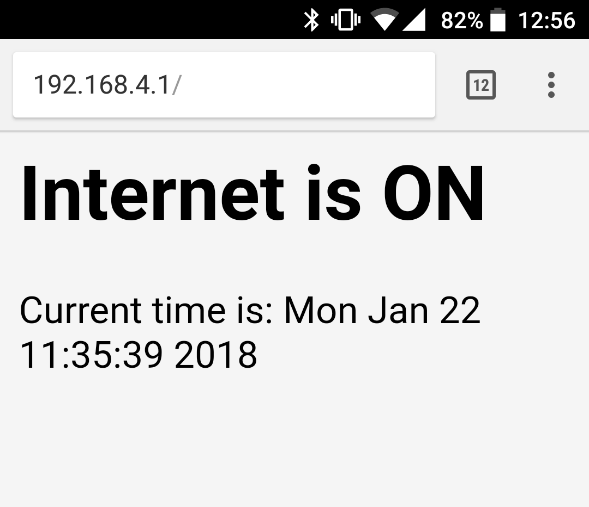

# Custom Sonoff S20

I wrote this code to run on a Sonoff S20 switch with my internet router plugged into it. When switched on it:

1. Turns on the router
2. Connects to the router
3. Obtains the current time via NTP
4. Checks if the time is either between 1am and 6am or 10am and 4pm on a weekday
5. If yes, it turns off the wifi router
6. If no, the wifi router stays on

It also provides a simple web interface to switch on the router for an additional 15 or 30 minutes

This is inspired by a similar project by Trandi: https://trandi.wordpress.com/2018/01/14/custom-remote-wifi-mains-socket-switch/
